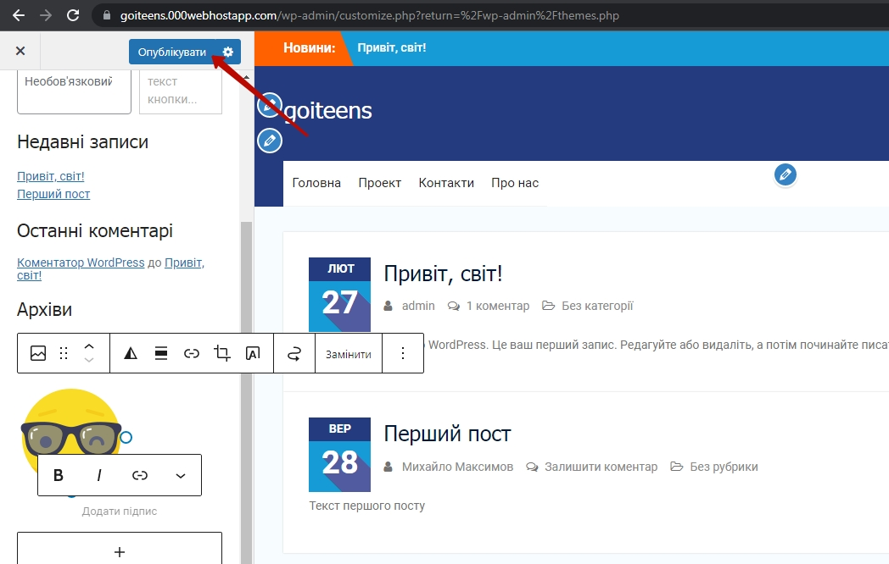

<<<<<<< HEAD
# Налаштування сайту на WordPress
## Меню
Створимо і налаштуємо меню.  
Для цього - створимо відповідні сторінки.  
  
  
Далі - перейдемо на сторінку меню і створемо нове меню:  
  
Оберемо сторінки, які додамо до меню.  Та натиснемо на кнопку "Додати до меню".  
  
Отримаємо в результаті - перелік доданих сторінок.  
  
За необхідністю змінемо порядок сторінок.  
  

Оберемо місце розміщення меню, та збережемо результат  
  

Побачимо результат.  
  

Змінемо текст посилання:  
  

Збережемо результат:  

  

Побачимо зміну на сайті:  

  

## Віджети
Одним з елементом кастомізації сторінок є віджети.

**Віджет** - це функціональні елементи на сторінці.

В нашому шаблоні місце для управління віджетами використовується пункт "Налаштування".  
  

Оберемо пункт "Віджети"  
  

Обираємо бічну панель (ту, яку будемо змінювати)
  

Видалимо блок "Категорії"  
  

  

Побачимо результат:  
  

### Додамо картинку.
Візьмемо картинку з сервісу **iconfinder**
  

Оберемо відповідне зображення  
  
  
Завантажимо обране зображення  
  
  
Додамо новий елемент у віджети  
  
  
Оберемо його тип ("Зображення")  
  

Оберемо "Завантаження" як спосіб додавання картинки  

  

Завантажемо скачане зображення  

  

Опублікуємо  

  

Побачимо результат:  

  

## Завдання
1. Створіть на власному сайті віджети різних типів.

=======
# Налаштування сайту на WordPress
## Меню
Створимо і налаштуємо меню.  
Для цього - створимо відповідні сторінки.  
  
  
Далі - перейдемо на сторінку меню і створемо нове меню:  
  
Оберемо сторінки, які додамо до меню.  Та натиснемо на кнопку "Додати до меню".  
  
Отримаємо в результаті - перелік доданих сторінок.  
  
За необхідністю змінемо порядок сторінок.  
  

Оберемо місце розміщення меню, та збережемо результат  
  

Побачимо результат.  
  

Змінемо текст посилання:  
  

Збережемо результат:  

  

Побачимо зміну на сайті:  

  

## Віджети
Одним з елементом кастомізації сторінок є віджети.

**Віджет** - це функціональні елементи на сторінці.

В нашому шаблоні місце для управління віджетами використовується пункт "Налаштування".  
  

Оберемо пункт "Віджети"  
  

Обираємо бічну панель (ту, яку будемо змінювати)
  

Видалимо блок "Категорії"  
  

  

Побачимо результат:  
  

### Додамо картинку.
Візьмемо картинку з сервісу **iconfinder**
  

Оберемо відповідне зображення  
  
  
Завантажимо обране зображення  
  
  
Додамо новий елемент у віджети  
  
  
Оберемо його тип ("Зображення")  
  

Оберемо "Завантаження" як спосіб додавання картинки  

  

Завантажемо скачане зображення  

  

Опублікуємо  

  

Побачимо результат:  

  

## Завдання
1. Створіть на власному сайті віджети різних типів.

>>>>>>> c3986eab10305c2430b183bd0f0ef786a9eff636
