# Основні плагіни WordPress
Плагіни в WordPress - це функціональні елементи, які дозволять створювати сайти, що виконують різні задачі: інформаційна сторінка організації, особистий блог, Інтернет-магазин.  
Плагіни, також, дозволяють дуже швидко розширити можливості сайта: додати слайд-шоу, мапу, форму зворотнього зв'язку, тощо.  
Із допомогою плагінів можна створювати власні інформаційні каталоги, та відмічати місця на мапі.

## Contact Form 7  
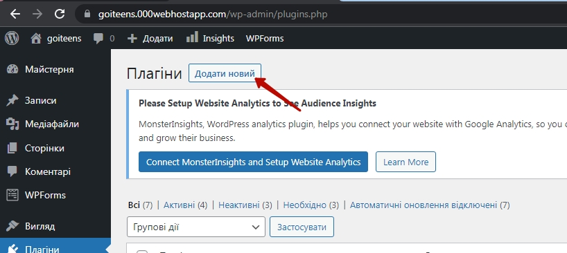  
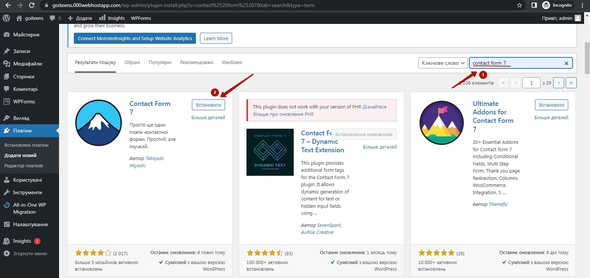  
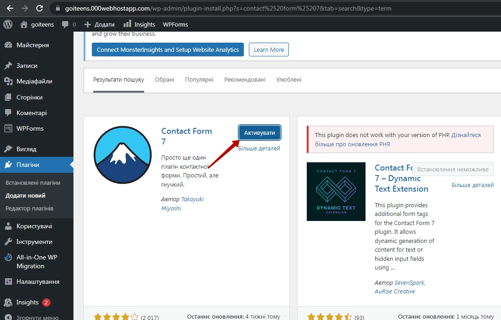  
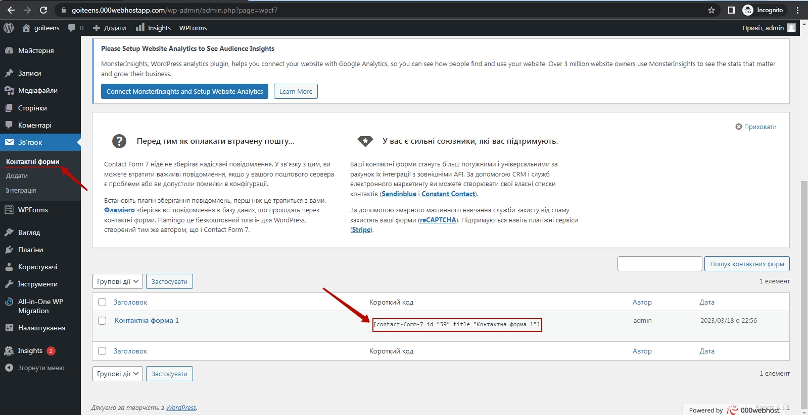  
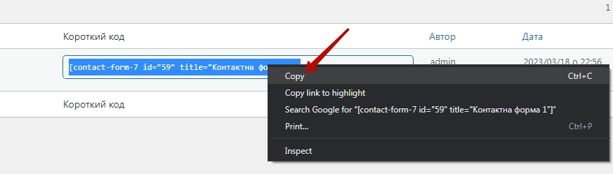  
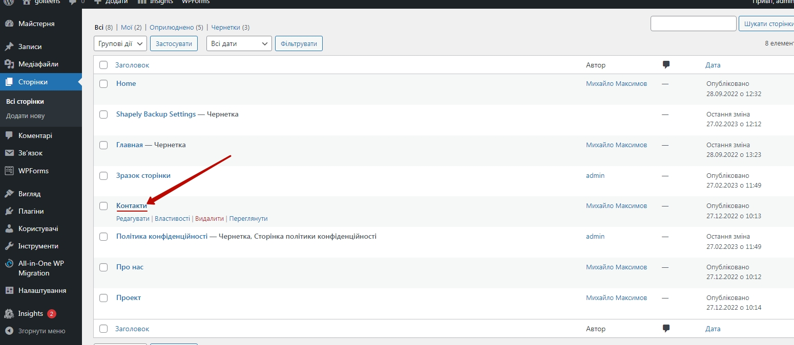  
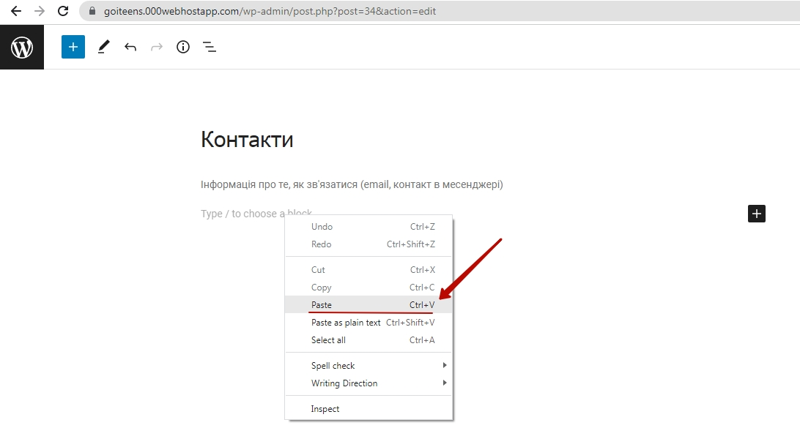  
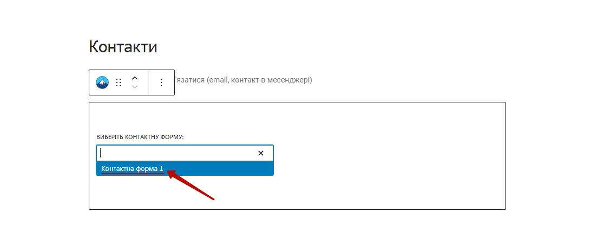  
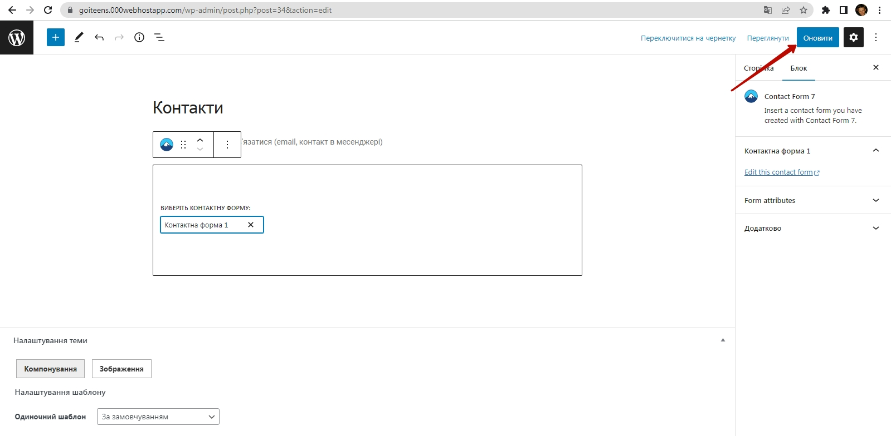  
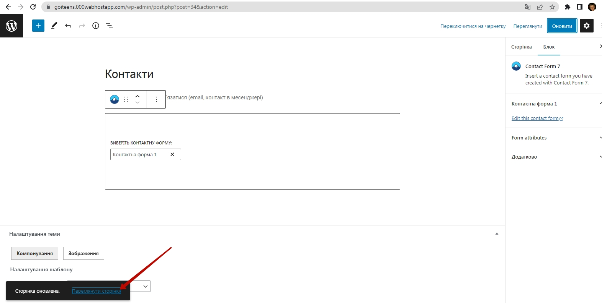  
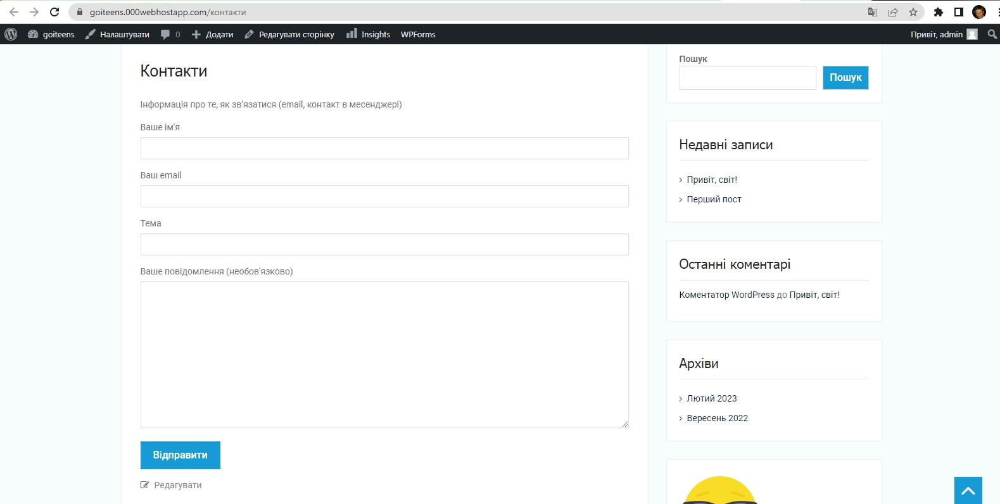  
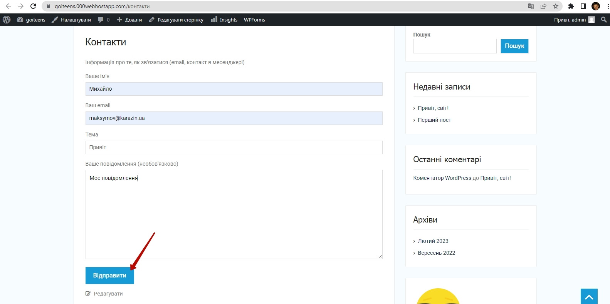  
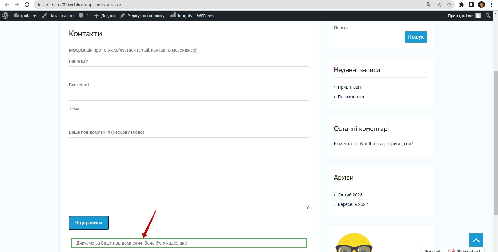  
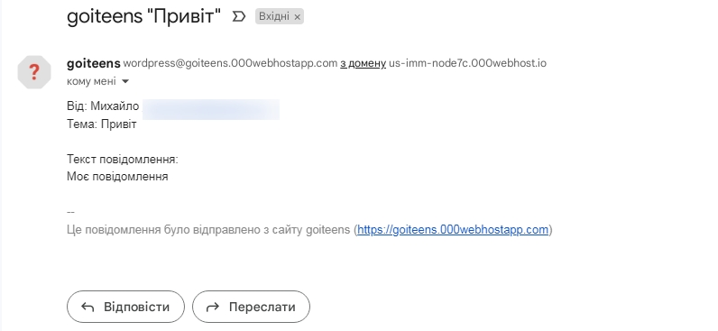  

## Contact From 7 DB  

Для того, щоб ми могли зберігати дані в адмінці (а не тільки отримувати їх на пошту) встановимо плагін **Contact Form 7 Database Addon – CFDB7**  
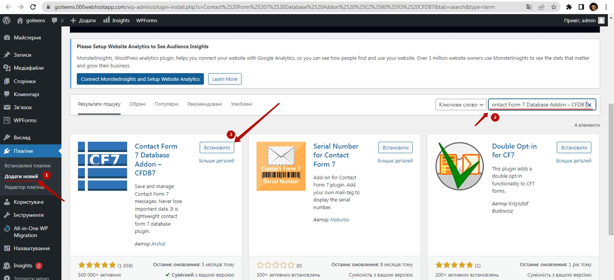  
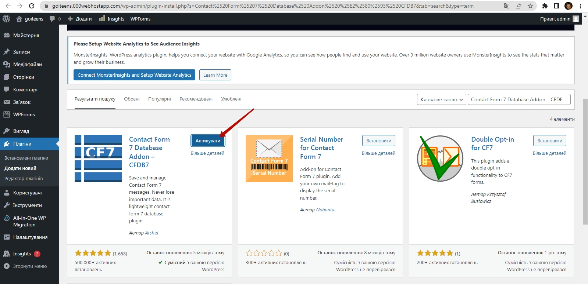  
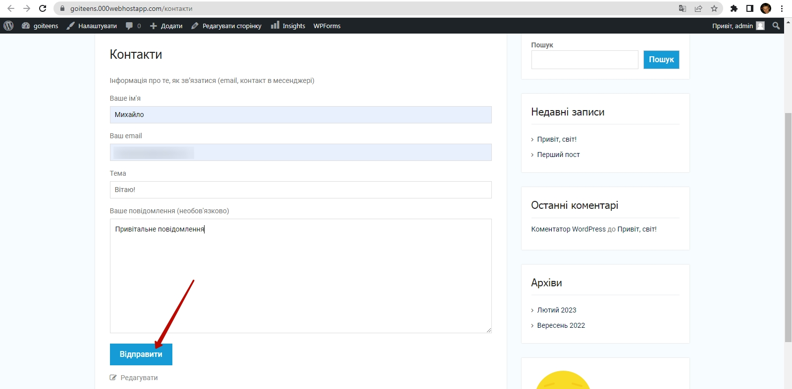  
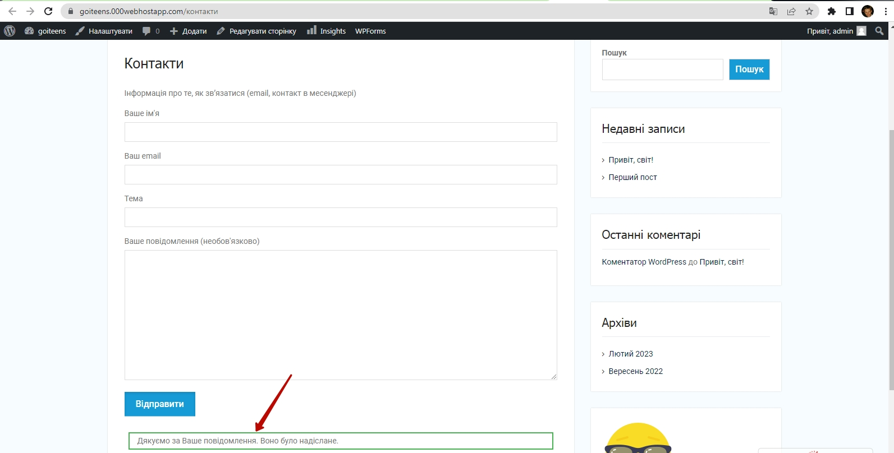  
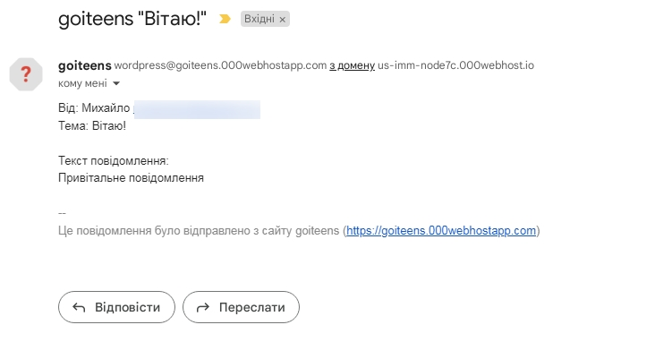  
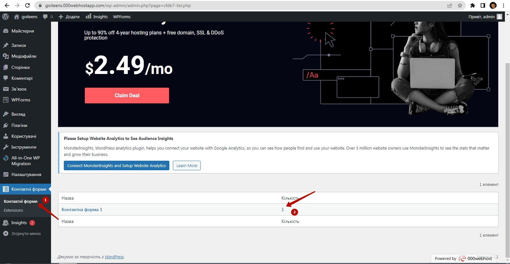  
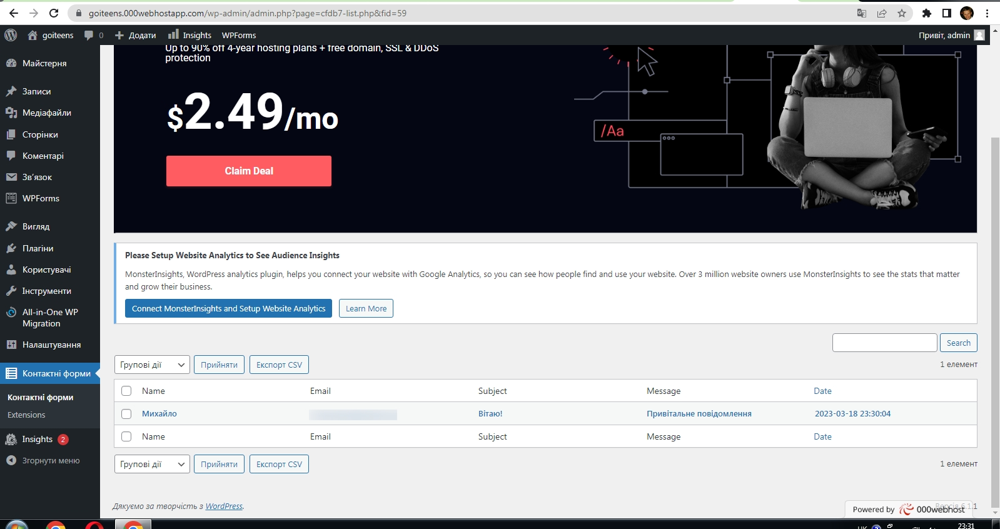  
  
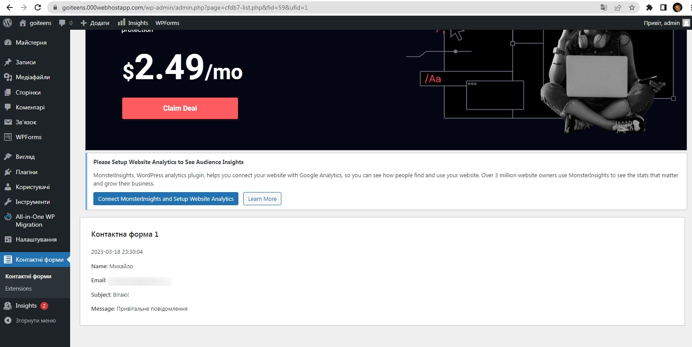  

## Yoast SEO

## Google maps

## Google analytics

